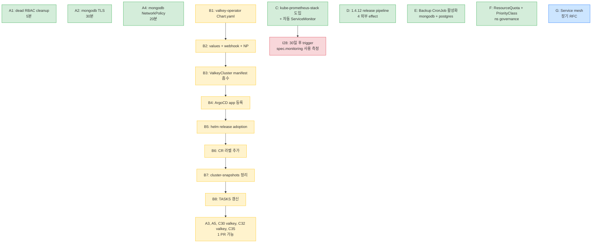

# Production-grade Sprint Plan — keiailab data plane

본 문서는 cluster-audit.md 의 격차 11건을 *통합 sprint* 로 묶어 단계적
실행하는 procedure. 모든 step 은 *외부 effect* 동반 → **사용자 명시 승인** 시
즉시 실행 가능.

## 현재 상태 (2026-05-07)

- clean 영역: 15건
- 격차: 11건
- clean ratio: **57.7%**
- 운영 안정: ✅ (errors 0, events 0, 9 ArgoCD apps Synced/Healthy)

## Sprint phases

### Phase A — Quick wins (인프라 즉시 활용)

**목표**: 1 PR / 1 cycle / *코드 변경 0* — 기존 인프라 활용도 최대화.

| Step | 영역 | 행동 | Repo | 예상 시간 |
|---|---|---|---|---|
| A1 | C29 dead RBAC cleanup | `kubectl delete clusterrole valkey-operator valkey-operator-metrics-auth && kubectl delete clusterrolebinding ...` | (cluster) | 5분 |
| A2 | C32 TLS in transit (mongodb) | keiailab-platform-data 의 `mongodb/values.yaml` 에 `mongoDB.tls.enabled=true` + `certManager.issuerRef.name=letsencrypt-prod` 추가, ArgoCD sync | keiailab-platform-data | 30분 |
| A3 | C32 TLS in transit (valkey, C24 통합 후) | (Phase B 의존) | — | — |
| A4 | C30 NetworkPolicy (mongodb) | 동 values.yaml 에 `networkPolicy.enabled=true` 추가, ArgoCD sync | keiailab-platform-data | 20분 |
| A5 | C35 valkey anti-affinity | (Phase B 의존) | — | — |

**증거 baseline**: cert-manager / NetworkPolicy / TLS spec invariant 모두
operator + cluster 인프라 *기 보유*. *chart values 1-2 line* 만 추가.

### Phase B — valkey GitOps 통합 (C24 + C29 + C32 valkey + C35)

**목표**: keiailab-valkey-prod 의 helm-direct → ArgoCD-managed 마이그레이션.

| Step | 행동 | Repo |
|---|---|---|
| B1 | keiailab-platform-data 에 `valkey-operator/Chart.yaml` 추가 (mongodb 패턴 차용 — keiailab/valkey-operator 1.0.3 dependency) | keiailab-platform-data |
| B2 | `valkey-operator/values.yaml` 에 `webhook.enabled=true` + `networkPolicy.enabled=true` (C30) | keiailab-platform-data |
| B3 | `valkey-operator/templates/valkeycluster.yaml` 에 keiailab-valkey-prod manifest 흡수 (DR snapshot `cluster-snapshots/2026-05-07/keiailab-valkey-prod.yaml` 기반) — TLS spec (C32) + anti-affinity (C35) 추가 | keiailab-platform-data |
| B4 | argocd Application `platform-data-valkey-operator` 신규 등록 | keiailab-platform-data application.yaml |
| B5 | 기존 helm release `valkey-operator-prod` adoption (annotation `meta.helm.sh/release-name` + label `keiailab.io/managed=argocd` 추가) — *zero-downtime* 보장 | (cluster) |
| B6 | 기존 ValkeyCluster CR 라벨 추가 (`keiailab.io/managed=argocd`) | (cluster) |
| B7 ✅ | `cluster-snapshots/2026-05-07/keiailab-valkey-prod.yaml` 제거 + `cluster-snapshots/README.md` 인덱스 갱신 (2026-05-21 완료) | mongodb-operator |
| B8 | C24 / C29 / C30 (valkey) / C32 (valkey) / C35 entries 100% 갱신 | mongodb-operator (TASKS.md) |

**Risk**: B5 의 helm adoption 단계가 *spec drift* 시 ArgoCD 가 *replace 또는
self-heal* 시도. *backup snapshot 보유 + dry-run preview* 후 진행.

### Phase C — Observability stack 도입 (C25 + I28 trigger)

**목표**: kube-prometheus-stack 도입 + 3 operator + workload metrics scrape.

| Step | 행동 | Repo |
|---|---|---|
| C1 | keiailab-platform-observability 에 `prometheus/Chart.yaml` (kube-prometheus-stack dependency) | keiailab-platform-observability |
| C2 | argocd Application `platform-observability-prometheus` 신규 등록 + Synced 확인 | keiailab-platform-observability application.yaml |
| C3 | ServiceMonitor / PrometheusRule CRD 등록 확인 (`kubectl api-resources \| grep monitoring.coreos.com`) | (cluster) |
| C4 | 기존 valkey-operator 의 fail-soft applyServiceMonitor 가 자동 ServiceMonitor 생성 — `kubectl get servicemonitor -n data` 검증 | (cluster) |
| C5 | mongodb / postgres 의 chart-level static ServiceMonitor (`templates/servicemonitor.yaml`) ArgoCD sync 후 자동 등록 | (cluster) |
| C6 | Grafana 대시보드 추가 (mongodb / valkey / postgres 별, kube-prometheus-stack 의 default 또는 별 chart) | keiailab-platform-observability |
| C7 | I28 trigger event — 30일 후 mongodb spec.monitoring.* 사용 빈도 측정 + Phase 2 결정 | mongodb-operator (별 cycle) |

**증거 baseline**: cert-manager 와 동일 패턴 — *infrastructure 도구 미설치 →
도입 → 즉시 활용*. valkey 의 *fail-soft* 가 *seamless 전환* 보장.

### Phase D — 1.4.12 release pipeline (T27)

**목표**: mongodb 1.4.11 → 1.4.12 운영 배포.

| Step | 행동 | Repo |
|---|---|---|
| D1 | mongodb-operator main branch state 확인 (it45-47 커밋 모두 push 됨, working tree clean) | mongodb-operator |
| D2 | `make release VERSION=v1.4.12` — docker buildx push to ghcr + git tag v1.4.12 + GH Release create + helm-publish (gh-pages) | mongodb-operator |
| D3 | keiailab-platform-data/mongodb/Chart.yaml: `dependencies[0].version: 1.4.11 → 1.4.12` + `appVersion: "1.4.11" → "1.4.12"` + 자체 version `0.1.12 → 0.1.13` | keiailab-platform-data |
| D4 | keiailab-platform-data umbrella push to stable branch → ArgoCD platform-data-mongodb auto-sync | keiailab-platform-data |
| D5 | data ns 의 mongodb-operator pod rollout 확인 (`kubectl get deploy -n data ... -o jsonpath='{.spec.template.spec.containers[0].image}'`) | (cluster) |
| D6 | keiailab-mongo MongoDBSharded reconcile 정상 진행 + 운영 영향 0 확인 | (cluster) |

**Risk**: webhook opt-in default-off 유지로 *현 운영 영향 0*. 단 chart 의
neue webhook template + cert-manager 의존성 검증 필요.

### Phase E — Backup 자동화 (C34)

**목표**: keiailab-mongo + keiailab-postgres backup CronJob 자동 생성.

| Step | 행동 | Repo |
|---|---|---|
| E1 | keiailab-mongo CR 의 `spec.backup` 활성화 — schedule (`0 2 * * *`), storage.s3 (Ceph RGW), retention.days=7. mongodb-operator webhook 의 backup invariant 자동 가드 | keiailab-platform-data |
| E2 | keiailab-postgres CR 동일 영역 활성화 (postgres-operator 의 backup spec) | keiailab-platform-data |
| E3 | 첫 backup 실행 (manual trigger or scheduled) + S3 bucket 검증 | (cluster) |
| E4 | restore drill — 별 ns 또는 staging 에 backup 으로 cluster 재생성 검증 | (cluster) |

### Phase F — Resource governance (C31 + C36)

**목표**: data ns 의 자원 한계 + priority class.

| Step | 행동 | Repo |
|---|---|---|
| F1 | `keiailab-platform-data/_namespaces/data.yaml` (또는 platform-base-namespaces) 에 ResourceQuota + LimitRange 추가 | platform-base-namespaces |
| F2 | PriorityClass 정의 (`keiailab-data-critical=10000`, `keiailab-data-default=1000`) | platform-base-namespaces |
| F3 | keiailab-mongo / keiailab-postgres / keiailab-valkey-prod CR 에 priorityClassName 추가 (operator 의 podTemplate 영역) | keiailab-platform-data |

### Phase G — Service mesh (C33, 장기)

별 RFC. ROI 검토 후 결정.

## Sprint 진행 의존성 그래프

레전드:
- 🟢 independent: 다른 phase 무관, 즉시 실행 가능.
- 🟡 sequential: 같은 phase 내 순서 의무.
- 🔴 blocked: 선결 조건 (다른 phase 완료) 의무.
- 🔵 long-term: 별 RFC 결정.

## 예상 결과 (Phase A-F 완료 후)

- clean ratio: 15/26 → **24/26 (92.3%)**
- 격차: 11 → 2 (G 장기 + I28 trigger 대기)
- 운영 영향: ✅ 모두 *non-disruptive* (rolling 또는 helm adoption).

## 후속 cycle 진입점

- 사용자 명시 승인 시 Phase A1-A4 즉시 실행 (가장 small / quick win).
- Phase B-F 는 *user-driven* 순서 — 우선순위 사용자 결정.
- I28 / G 는 30일 / RFC 후 별 cycle.
